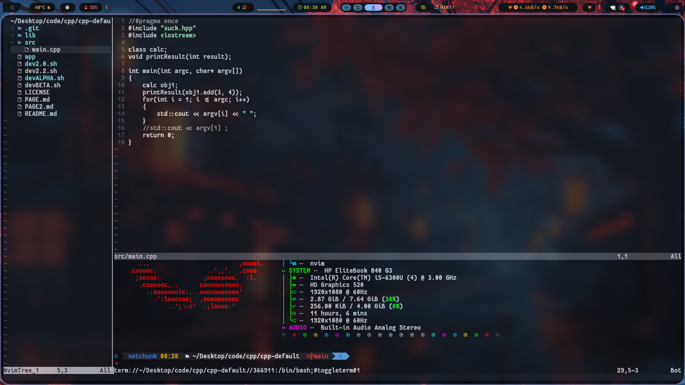
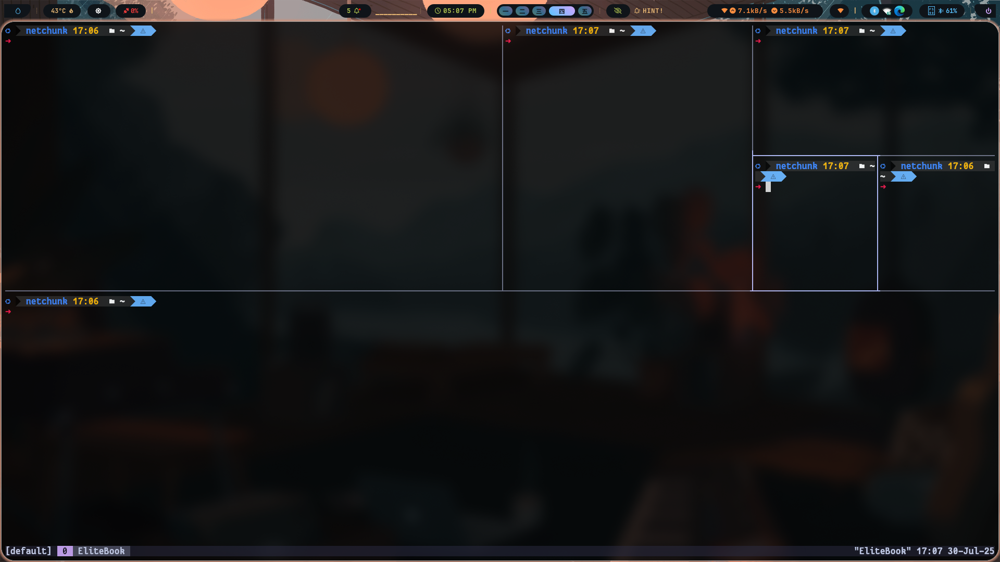
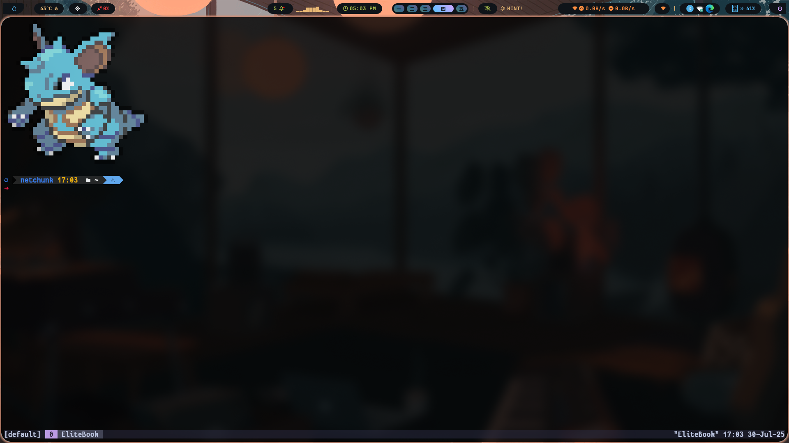

# Dotfiles

Welcome to my dotfiles repository! This repo, `Miraj13123/dotfiles`, centralizes my configuration files for tools like Oh-My-Posh, Neovim, Kitty, Tmux, and Bash, making it easy to set up a consistent development environment. The `installer.sh` script automates downloading and installing these dotfiles with a user-friendly menu, perfect for beginners and advanced users alike. Use this repo to adopt my configurations or as a template for your own dotfiles.

<p align="center">
  
</p>

---

## ✨ Table of Contents
- [Gallery](#gallery)
- [Usage Guide](#usage-guide)
- [Prerequisites](#prerequisites)
- [Repository Structure](#repository-structure)
- [Installation Details](#installation-details)
- [Controls and Keybindings](#controls-and-keybindings)
- [License](#license)

---

## 🖼️ Gallery
```
Neovim | Tmux
-------|------
Kitty  | Bash
```
<div style="display: flex; flex-wrap: wrap; gap: 10px;">
  <div style="flex: 1; min-width: 45%; max-width: 45%;">
    
    
  </div>
  <div style="flex: 1; min-width: 45%; max-width: 45%;">
    
    
  </div>
</div>

---

## 📚 Usage Guide

The `installer.sh` script is your entry point for managing dotfiles. Follow these steps to get started:

1. **Clone the Repository**:
```bash
git clone https://github.com/Miraj13123/dotfiles.git
cd dotfiles
```

2. **Run the Installer**:
```bash
chmod +x installer.sh
./installer.sh
```

3. **Navigate the Menu**:
``` 
- `0`: Download dotfiles for Oh-My-Posh, Neovim, Kitty, Tmux, or Bash (individually or all at once via a sub-menu).
- `1`: Install all dotfiles (requires all dotfiles to be downloaded).
- `2-6`: Install dotfiles for Oh-My-Posh, Neovim, Kitty, Tmux, or Bash individually.
- `7`: Display information about some options
- `x`: Exit the script.
```
- The script checks for `.git` in each tool’s folder to enable installation options.
- A sub-menu for option `0` lets you choose which dotfiles to download.

4. **Follow Prompts**:
``` 
- The script prompts for confirmation before major actions (e.g., downloading, installing).
- For example, the Neovim installer checks for Neovim and configuration files, asking for y/n input.
```

---

## 📋 Prerequisites

Before running `installer.sh`, ensure the following are installed:
- **Git**: To clone repositories and check `.git` folders.
- **Curl**: For downloading dotfiles.

Install these on a Debian-based system:
```bash
sudo apt update
sudo apt install -y git curl
```

On an Arch-based system:
```bash
sudo pacman -Syu --noconfirm git curl
```

---

## 🗂️ Repository Structure

The repository is organized as follows: 
``` 
dotfiles/
├── .git/
├── bash/
│   └── installer_bash_dots.sh
├── kitty/
│   ├── installer_kitty_dots.sh
│   ├── kitty_custom.conf
│   ├── kitty-colors.conf
│   └── kitty-themes/
├── nvim/
│   └── installer_nvim_dots.sh
├── omp/
│   └── installer_omp_dots.sh
├── tmux/
│   └── installer_tmux_dots.sh
├── installer.sh
└── LICENSE
```
- [ the structure show the state after you download all the sub repos through the installer ]
- Each tool’s folder contains its installer script and configuration files.
- The root `installer.sh` orchestrates downloading and running these installers.

---

## 🛠️ Installation Details

The `installer.sh` script performs the following:
- **Download Dotfiles**: Clones configurations from GitHub (e.g., `https://github.com/Miraj13123/Neovim.git` for Neovim) into folders like `nvim`, `kitty`, etc.
- **Check Dependencies**: Verifies `.git` presence in each tool’s folder to enable installation.
- **Run Installers**: Executes tool-specific installers (e.g., `installer_nvim_dots.sh`):
  - **Oh-My-Posh**: Installs Oh-My-Posh and its configuration.
  - **Neovim**: Installs Neovim and copies `init.lua` and `init_custom.lua` to `~/.config/nvim`.
  - **Kitty**: Installs Kitty, FantasqueSansM Nerd Font Mono, and copies `kitty_custom.conf`, `kitty-colors.conf`, and themes to `~/.config/kitty`.
  - **Tmux**: Installs Tmux and its configuration.
  - **Bash**: Installs Bash configuration files.
- **User Interaction**: Prompts for y/n confirmation before actions, ensuring control.

Each installer can be run standalone (e.g., `bash nvim/installer_nvim_dots.sh`).

---

## ⌨️ Controls and Keybindings

For detailed keybindings and configurations:
- **Neovim, Kitty, Tmux, Bash, Oh-My-Posh** : See the [Neovim repository](https://github.com/Miraj13123/Neovim) and the respective repositories for keybindings and navigation tips.
- **Vim Motions** : [Vim Motions and Modes](https://github.com/Miraj13123/extras/blob/main/files/vim/vim_motions_modes.md).

---

## 📜 License

This repository is licensed under the [Apache 2.0 License](LICENSE).

---

[](https://github.com/Miraj13123/dotfiles)
[](https://x.com/Mahmudul__Miraj)