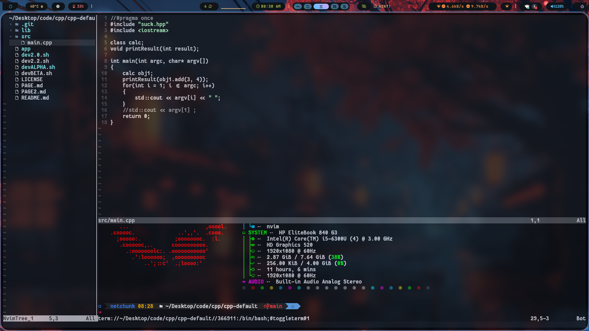
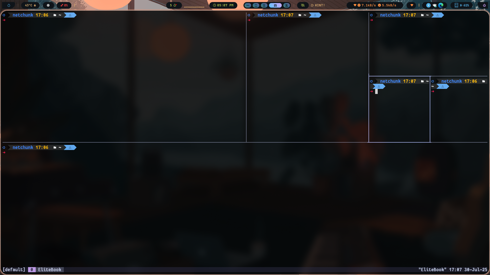
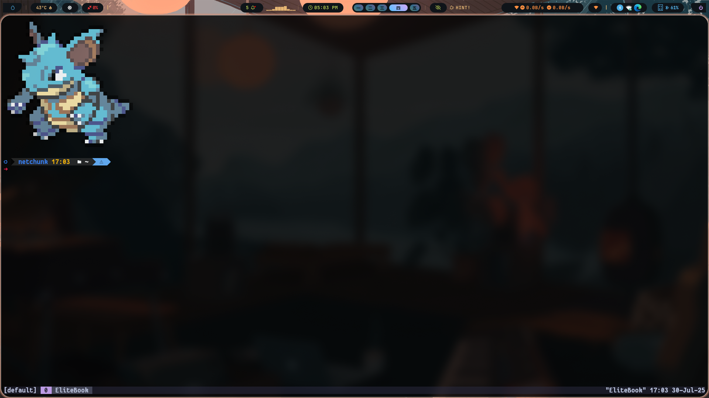

# Dotfiles

Welcome to my dotfiles repository! This repo, `corechunk/dotfiles`, has evolved from a modular installer into a sophisticated, matrix-driven orchestrator (Hub V2) for managing high-performance development environments. It centralizes configurations for Hyprland, Waybar, Neovim, Kitty, Tmux, and more, offering a two-phase deployment system (Vault Sync -> System Deploy) to ensure consistency and reproducibility across machines.

<p align="center">
  
</p>

---

## 🚀 Sub-repositories Included

*   [**Hyprland**](https://github.com/corechunk/hyprland) : Dynamic Tiling Window Manager.
*   [**Waybar**](https://github.com/corechunk/waybar) : Customizable status bar.
*   [**Quickshell**](https://github.com/corechunk/quickshell) : Flexible shell UI.
*   [**Wallust**](https://github.com/corechunk/wallust) : Dynamic colors.
*   [**Fastfetch**](https://github.com/corechunk/fastfetch) : System info.
*   [**Neovim**](https://github.com/corechunk/Neovim) : Extensible text editor (LazyVim based).
*   [**Kitty**](https://github.com/corechunk/Kitty) : GPU terminal.
*   [**Bash**](https://github.com/corechunk/Bash) : Shell config.
*   [**Tmux**](https://github.com/corechunk/Tmux) : Multiplexer.
*   [**Oh-My-Posh**](https://github.com/corechunk/omp) : Prompt engine.
*   [**Wallpapers**](https://github.com/corechunk/wallpaper_minecraft) : Minecraft, OS, and JaKooLit collections.

---

## 🗂️ Repository Structure

The Hub V2 uses a "Vault" system to manage versioned bundles.

```text
dotfiles/
├── main.sh             # V2 Core Orchestrator (Entry Point)
├── matrix.txt          # Version Source of Truth
├── installer.sh        # Legacy V1 Menu
│
├── processing/
│   ├── bundles/        # The Vault (Versioned clones)
│   └── cache/          # Metadata storage
│
├── assets/             # Persistent Wallpapers/Themes
└── src/                # Modular V1 Source Scripts
```

---

## ✨ Table of Contents
- [Gallery](#gallery)
- [Usage Guide](#usage-guide)
- [Developer Documentation](#-developer-documentation)
- [Terminal Interface](#-terminal-interface)
- [License](#license)

---

## 🖼️ Gallery

<table align="center">
  <tr>
    <td align="center"><b>Neovim</b></td>
    <td align="center"><b>Kitty</b></td>
  </tr>
  <tr>
    <td></td>
    <td></td>
  </tr>
  <tr>
    <td align="center"><b>Tmux</b></td>
    <td align="center"><b>Bash</b></td>
  </tr>
  <tr>
    <td></td>
    <td></td>
  </tr>
</table>

---

## 📚 Usage Guide

### **1. Interactive Hub**
Launch the visual orchestrator to manage bundles and assets.
```bash
./main.sh
```

### **2. Non-Positional Flags (CLI Mode)**
Automate your setup with specialized flags:
*   `--mode [rookie|force|interactive]` : Set deployment strategy.
*   `--bundle [version]` : Target a specific version from `matrix.txt`.
*   `--type [dotfile|wallpaper]` : Filter components for CLI listing.

**Example Command:**
```bash
# Force install bundle 1.0.0 silently
./main.sh --bundle 1.0.0 --mode force install
```

---

## 🛠️ Developer Documentation
For deep dives into the Hub V2 architecture and internal logic:
*   [**Architecture Map**](map.md) : Visual execution trees and argument flow.
*   [**Function Logic**](func.md) : Detailed breakdown of parsers and shadowing.

---

## 📋 Prerequisites
- **Git**: For vault synchronization.
- **Tput / Lsb_release**: For UI colors and distro detection.
- **Grep / Sed**: For matrix parsing.

---

## ⌨️ Terminal Interface

| Action | Logic |
| :--- | :--- |
| `bundles` | Lists all available versions in the Matrix. |
| `components` | Lists all registered keys (supports `--type`). |
| `count` | Returns total number of registered components. |
| `check-update` | Compares local vault against latest remote tags. |

---

## 🖱️ Redirections & References
- **Neovim Config** : See the [Neovim repository](https://github.com/corechunk/Neovim) for detailed keybindings.
- **Vim Motions** : [Learn Vim Motions and Modes](https://github.com/corechunk/extras/blob/main/files/vim/vim_motions_modes.md).

---

## 📜 License
This repository is licensed under the [MIT License](LICENSE).

---

<p align="center">
  <b>STAY CHILLY - Built by netchunk</b><br/>
  <a href="https://github.com/corechunk/dotfiles">
    
  </a>
  <a href="https://x.com/Mahmudul__Miraj">
    
  </a>
</p>
